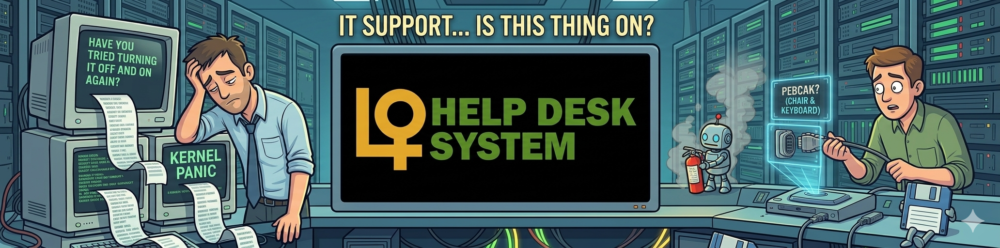

<!-- Banner Image -->


<table border="0">
  <tr>
    <td>
      <h1>💻 LMD Help-desk System</h1>
      <p><strong>Built for Lepanto Mine Division — supporting their people, not just their machines.</strong></p>
    </td>
  </table>
</table>

---

## 🚀 What is this?

The **LMD Help-desk System** is a centralized **IT ticketing system** designed for **Lepanto Mine Division (LMD)** employees and affiliated users to report and resolve **technology-related problems**.

Whether your screen froze, your printer is speaking in tongues, or you can't connect to the network — this is where you get help.

> 🪛 **Not for mining operations.** This is for **people support** — the humans behind the helmets.

---

## 🎯 Who is this for?

| User Type | What they do |
|-----------|----------------|
| 🧑‍💼 LMD Employees | Report IT issues (hardware, software, network, email, etc.) |
| 🛠️ MIS Support Team | Receive, prioritize, assign, and resolve tickets |
| 👑 System Admin | Manage users, categories, reports, and system settings |

---

## 📈 Flowchart


> User reports problem → Ticket created → Support assigns → Status updates → Resolution & feedback.

---

## 🛠️ Tech Stack

| Tool | Version |
|------|---------|
| **Node.js** | `v24.2.0` |
| **SQL Server** | `20.2.30.0` |

---

## ✨ Features

| Feature | What it does |
|--------|----------------|
| 📝 Submit Ticket | Report tech issues with title, description, and category |
| 🏷️ Categories | Hardware, Software, Network, Email, Printer, Access, etc. |
| ⚡ Priority | Low 🟢 / Medium 🟡 / High 🔴 / Urgent ⚠️ |
| 👥 Assignment | Auto or manual assignment to available MIS staff |
| 📊 Dashboard | See your tickets, open tickets, resolution stats |
| 🔔 Status Updates | In Progress → Resolved → Closed (with notes) |
| 📎 Attachments | Screenshots or logs to help diagnose faster |
| ⭐ Feedback Rate | Users can rate support after ticket is closed |

---

## 🏢 Why "LMD"?

**Lepanto Mine Division** uses this system to keep their **office, admin, and operational support staff** productive.  
When tech fails, work stops. This system makes sure it starts again — fast.

---

## 📦 Quick Start

```bash
git clone https://github.com/yourusername/lmd-helpdesk.git
cd lmd-helpdesk
npm install
npm run setup-db
npm start
